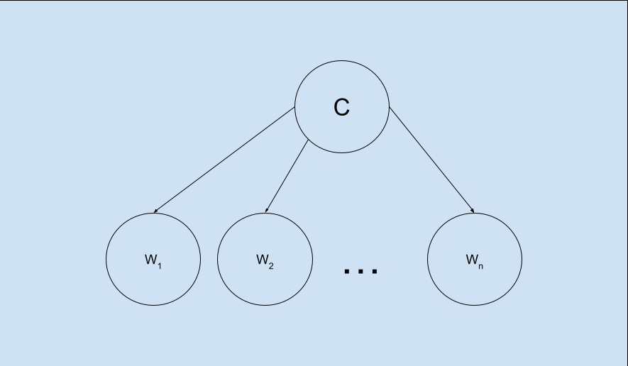

Model: [CSE150AMilestone2.ipynb](https://github.com/KyleL1015/CSE150AMilestone2/blob/main/CSE150AMilestone2.ipynb)

Overview:
This project classifies news articles as either real or fake using a Multinomial Naive Bayes model. Naive Bayes is a probabilistic learning algorithm based on Bayes' Theorem, which assumes that all features are conditionally independent given the class label. In this case, the class label represents whether an article is real or fake, while the features are the processed words from the article's title and text. "Multinomial" here means that the model considers the frequency of each word in the document rather than whether it exists or not.

Below is a diagram of the model, where $$w_1, w_2, ..., w_n$$ represent the words from the dataset the model was trained on, and $$C$$ represents the predicted class of the article which are real or fake.

  

PEAS:
In terms of PEAS, the environment for our model would be news articles from the past to the present, especially ones where it's difficult to determine credibility, as they are a solid testing ground for how accurate our model is. Specifically it looks at the dataset from [Kaggle](https://www.kaggle.com/datasets/clmentbisaillon/fake-and-real-news-dataset/data). The performance measure of our model is the accuracy and recall of its prediction of whether it is real or fake news article. Its actuators are the notebook outputs where we're able to gauge the accuracy of its guesses. The sensors for our model is the model itself taking in data from the tables.

Agent Type:
We first preprocessed our data to get it ready for computation. Initially we checked if and rows had NULL values or blank titles and got rid of any of those. Then we got rid of data we aren't currently considering (like the text in the article or the date the article was published) and classified it depending on whether the article is true or not. While preprocessing, we also got rid of very common words such as "the" or "and" as they shouldn't affect the probability of an article being real or fake and converted our words into numbers using Tfidf in order to train our model.

Our agent is a probabilistic, passive, supervised learning agent. It is trained on the initial dataset and can be improved via retraining, but doesn't automatically train itself given data. By using the Naive Bayes assumption, all words in the title/text are assumed to be independent from each other. The probability for each word is given by

$$
P(w_i \mid C) = \frac{\text{count}(w_i, C) + α}{\sum_{j} \text{count}(w_j, C) + αV}
$$

where C is the class of the article(real or fake), α = 1, and V is the number of unique words in the training data. The α value (Laplace Smoothing) makes it so that inputted words that don't appear in the training data won't have a probability of 0 ruining our results. Then by multiplying all of our probabilities together and performing Bayes' Theorem, we can get a value proportional to P(C | e) where e is our evidence. The P(e) in the denominator of Bayes Theorem isn't necessary because the value of the denominator for fake/real news will be the same.

$$
P(C \mid e) \propto P(C) \prod_{i=1}^{n} P(w_i \mid C)
$$

Conclusion:
Using the Multinomial Naïve Bayes model, we achieved an overall accuracy of 93.62% on our test dataset, demonstrating strong performance despite the model's conditional independence assumption. The classification report shows that the model performs slightly better at detecting fake news (label 0) with a recall of 94%, compared to 93% recall for real news (label 1). Both precision and recall for each class remain consistently around 93% - 94%, indicating balanced performance.

Examining the confusion matrix, we observe that the model correctly classified 6640 fake news articles and 5971 real news articles, while making only 429 false positive errors (fake news misclassified as real) and 430 false negative errors (real news misclassified as fake). The low false positive and false negative rates suggest that the model is reliable in distinguishing real from fake news!

For future improvements, we could enhance the model by incorporating something like n-grams (bigrams or trigrams) to capture contextual patterns that might be more indicative of real or fake news. Also, hyperparameter tuning, such as optimizing the Laplace smoothing parameter (α), could help improve the agent's performance. Perhaps also somehow giving context of the date and whether the word is part of title or text can also help improve the performance of this agent.
